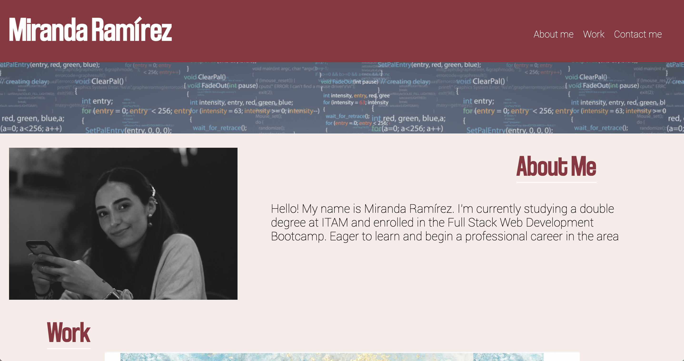
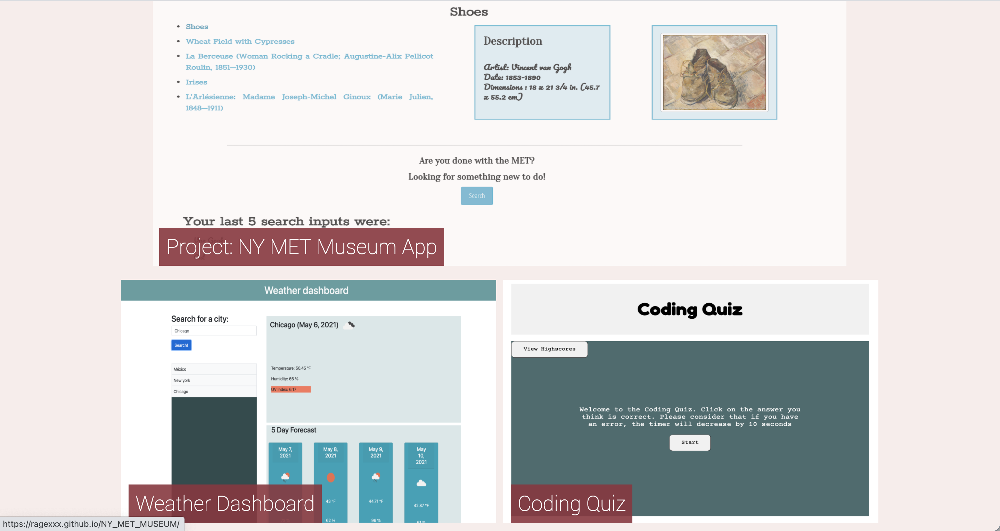
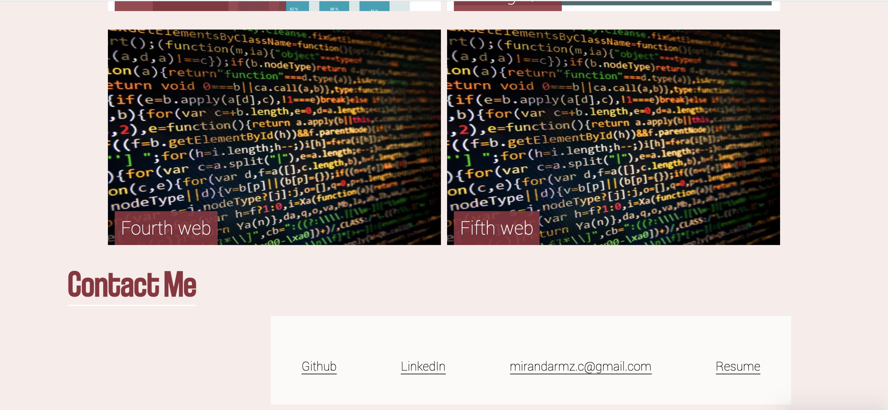

# Portfolio

## The task

Webpage portfolio to introduce my main work. It includes 3 main sections:
* About me
* My work
* Contact me
The purpose of the webpage is to showcase my current abilities regarding CSS.

## The elements

Some of the elements that needed to be showcased include the following:
+ Links in the header that lead to the different sections of the website available
+ Responsive elements that allows the webpage to adapt depending on the size of the webpage 
+ Responsive elements that interact with the user (ex. hovering)
+ Displayment of photos with different characteristics 
+ Footer and headeer 
+ Conact me section with working links 

## Images of deployed application 

## Deployed application
* Github repository https://github.com/Mirandarmz/Portfolio: 
* Deployed application: https://mirandarmz.github.io/Portfolio/